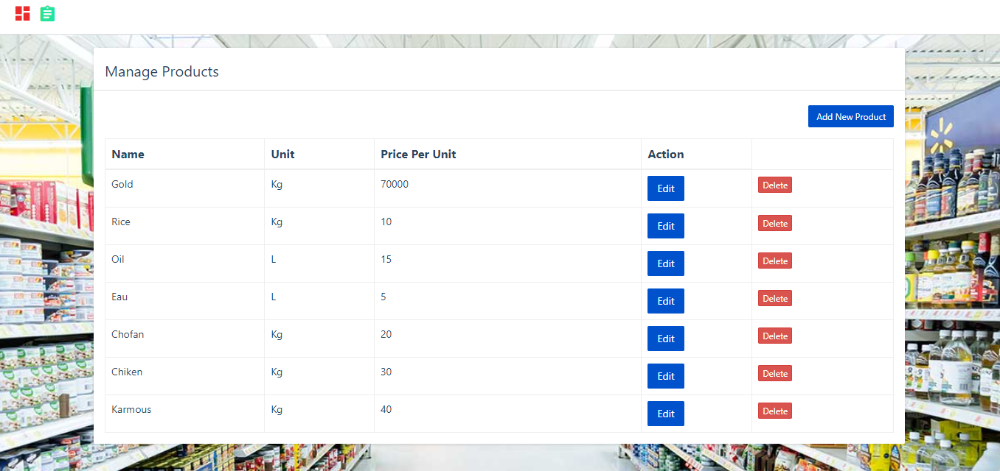
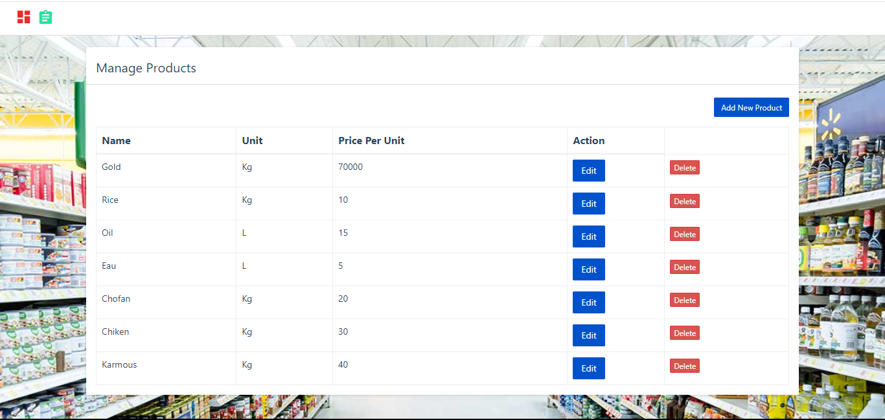

# 🏬 Store Management System

This project is a **web-based Store Management System** designed to streamline the process of managing products, orders, and customer data for retail stores. It offers a user-friendly interface for adding products to the store's inventory, placing orders, and calculating order totals dynamically. The system is built using **JavaScript**, **jQuery**, and a **Flask-based backend**, with a focus on efficiency and ease of use.

### 🛠️ Installation Instructions:

1. 📥 **Download MySQL for Windows**: [Download Link](https://dev.mysql.com/downloads/installer/)
2. 💻 Install the required Python package:
   ```bash
   pip install mysql-connector-python


### ✨ Features:

- 📦 Product Management: Add, edit, and manage products with ease, including assigning prices and units of measure.
- 🛒 Dynamic Order Processing: Create orders by selecting products, specifying quantities, and automatically calculating total prices based on the product's unit price.
- ✅ Real-time Validation: Ensures that essential fields like customer name are filled before allowing an order to be placed.
- 🔗 API Integration: Leverages RESTful API calls to fetch product data and save orders to the backend.
- 🖥️ User-Friendly Interface: Simple, intuitive layout for both experienced users and those new to store management software.

### 🛠️ Technologies Used :
- Frontend: 🌐 JavaScript, jQuery, HTML, CSS, Bootstrap
- Backend: 🐍 Flask (Python)
- Database: 🗄️ MySQL
- API: 🔌 RESTful API for product and order management





